```{r setup, include=FALSE}
knitr::opts_chunk$set(echo = FALSE)
```


## Xi Slide #1

- Bullet 1
- Bullet 2
- Bullet 3

## Alexis!

- Github Issues
- First Data Visualization/Table
- Correlations
- Next Steps for Data Analysis

## Github Issues
- Biggest Challenge - LOL
- Getting this photo on here was also a challenge

\newline

<center>
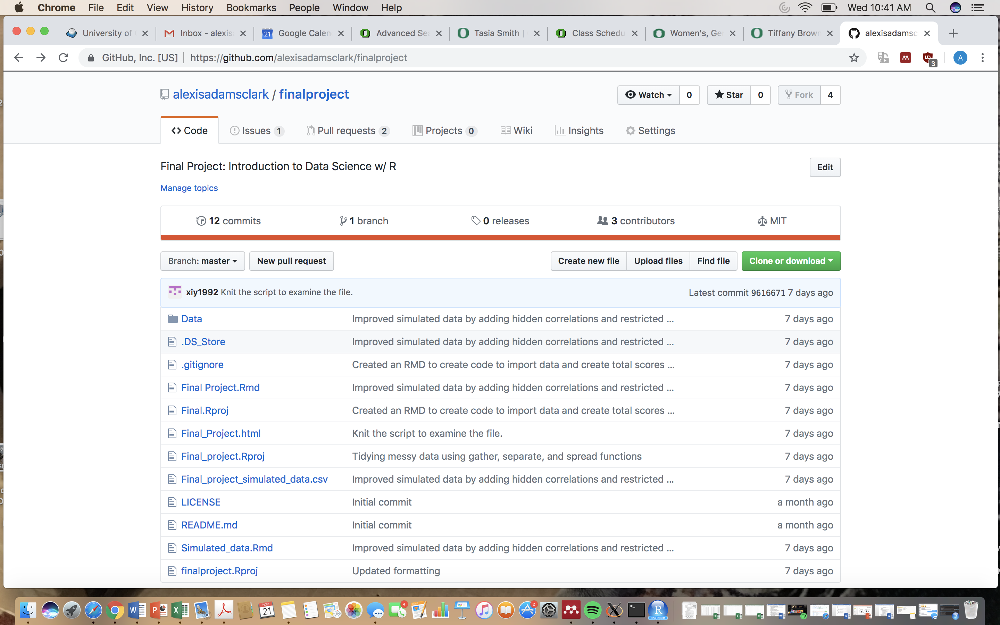
</center>

## First Data Table and Visualization
- Mutate, Group By, Summarize

\newline

<center>
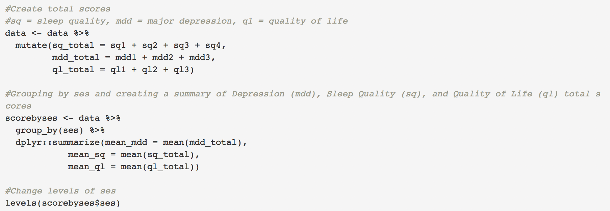
</center>

## First Data Table and Visualization
- Changing Order of Labels

\newline

<center>
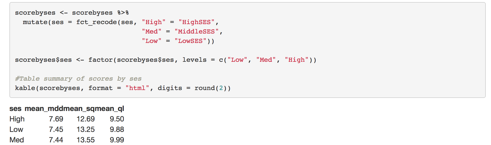
</center>

##Data Visualization- Bar Graph
<center>
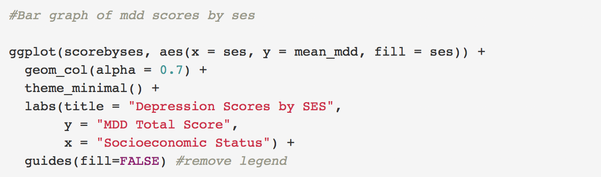
</center>

\newline

<center>
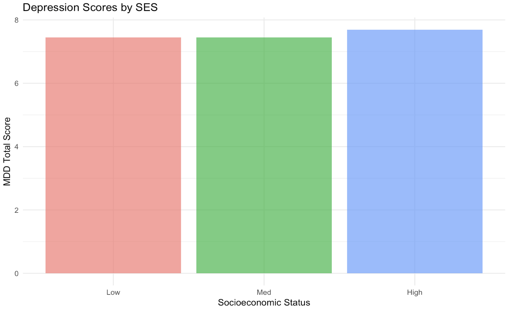
</center>

## Correlations
<center>
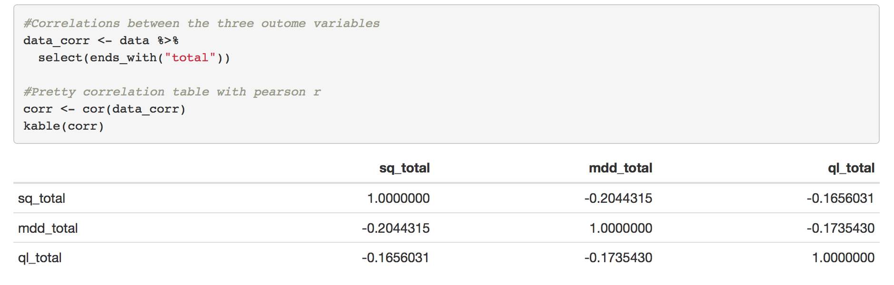
</center>

## Correlations
<center>
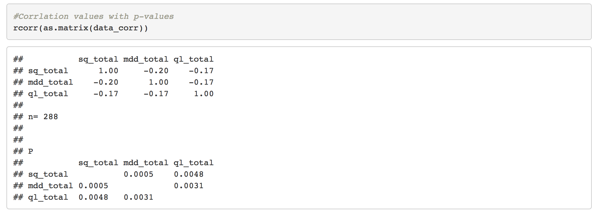
</center>

## Next Steps
- Modeling using lm package

\newline

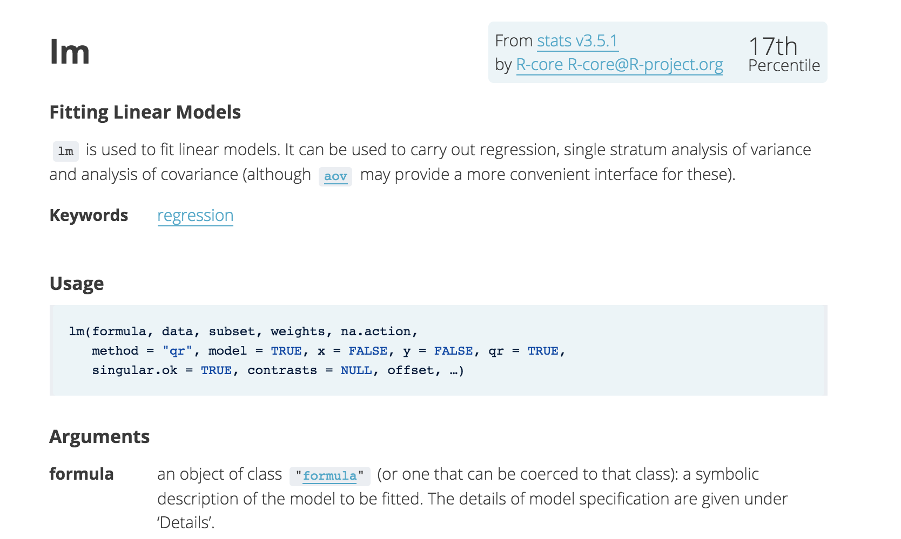
</center>


##Pretty plots and pretty data!

- Data visualization
    - Series of scatterplots
- Tidying data
    - Gather, separate, and spread

## Data Visualization - Scatterplot 1

<left>
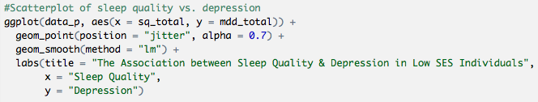
</left>

\newline

<left>

</left>

## Data Visualization - Scatterplot 2

<left>
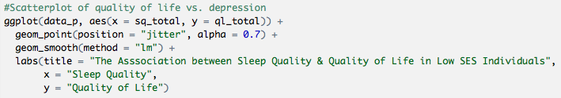
</left>

\newline

<left>

</left>

## Data Visualization - Scatterplot 3

<left>
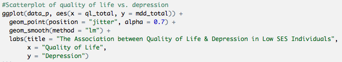
</left>

\newline

<left>
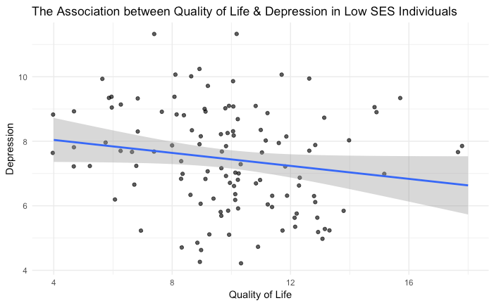
</left>

## Tidying data - Gather, separate, and spread

<left>
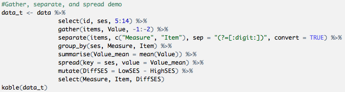
</left>

\newline

<left>
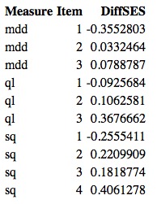
</left>

## Plotting the tidy data

<left>
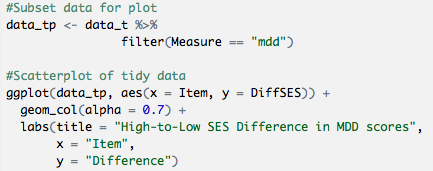
</left>

\newline

<left>
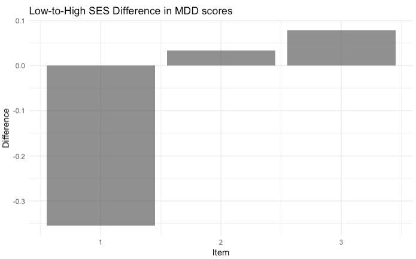
</left>