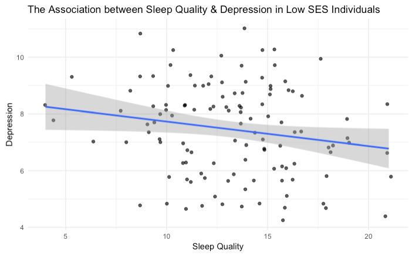
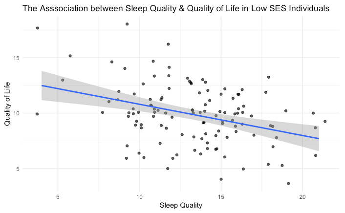
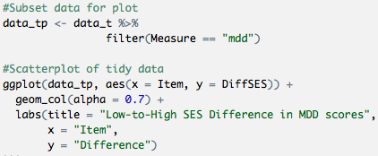

```{r setup, include=FALSE}
knitr::opts_chunk$set(echo = FALSE)
```


## Xi on Data Simulation

- Challenges
- Celebrations
- Continued steps

## Data Simulation

- Why? 
    - Dataset on github is likely to be open to the public, 
per Daniel's suggestion, we decided to simulate a dataset
- What? 
    - *Main variables:* 
        - Continuous measures of sleep quality, 
depression symptoms, 
quality of life indices
    - Covariates: 
        - socioeconomic status, education, and ethnicity
- How?
    - Simstudy package

\newline

<center>

</center>

## Data Simulation Challenges

- specify hidden correlations among the variables
    - Past error: Lower life quality was associated with higher sleep quality and depression?
- specify scale item ranges
    - Past error: Negative values for the items?

## Data Simulation Celebrations
- specify hidden correlations among the variables
\newline

<center>

</center>

    - mu: a vector of means
    - sigma: standard deviation of variables
    - cs: a compound symmetry structure

- specify scale item ranges
    - dt <- dt %>%
  filter(QL1 > 0 & QL3 > 0 & SQ2 > 0 & SQ4 > 0) %>%
  filter(MDD2 < 6)

## Data Simulation Continued Steps
- utilize more effective functions
\newline

<center>

</center>

- clean up the script structure

## Alexis!

- Github Issues
- First Data Visualization/Table
- Correlations
- Next Steps for Data Analysis

## Github Issues
- Biggest Challenge - LOL
- Getting this photo on here was also a challenge

\newline

<center>

</center>

## First Data Table and Visualization
- Mutate, Group By, Summarize

\newline

<center>

</center>

## First Data Table and Visualization
- Changing Order of Labels

\newline

<center>

</center>

##Data Visualization- Bar Graph
<center>

</center>

\newline

<center>

</center>

## Correlations
<center>

</center>

## Correlations
<center>

</center>

## Next Steps
- Modeling using lm package

\newline


</center>


##Andrew with some pretty plots and pretty data!

- Data visualization
    - Series of scatterplots
- Tidying data
    - Gather, separate, and spread

## Data Visualization - Scatterplot 1

<left>

</left>

\newline

<left>

</left>

## Data Visualization - Scatterplot 2

<left>

</left>

\newline

<left>

</left>

## Data Visualization - Scatterplot 3

<left>

</left>

\newline

<left>

</left>

## Tidying data - Gather, separate, and spread

<left>

</left>

\newline

<left>

</left>

## Plotting the tidy data

<left>

</left>

\newline

<left>

</left>